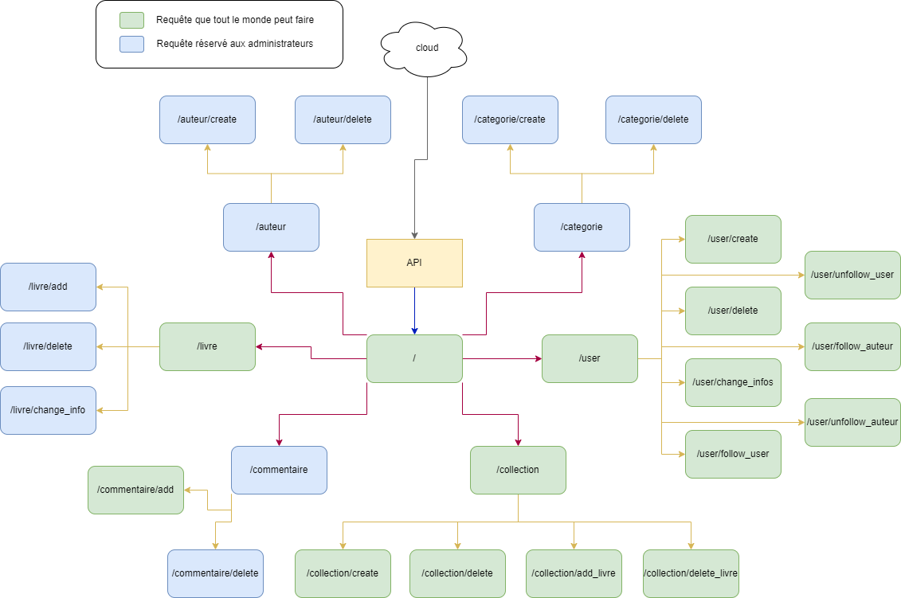

# API Projet Final B2 (avec Patchouf)

Vous trouverez dans ce repo la base de donnée de notre projet de fin de deuxième année.

- Repository principal : [Projet_Final_B2](https://github.com/Patchouf/Projet_B2)

### Ce repo contient :
- La configuration de notre API en C#,
- Le code de l'API (Program.cs et SQLRequest.cs)

### Lancement

Vous devez d'abord télécharger .NET 8.0.
Puis, placez vous dans la racine du dossier et executer la commande suivante: 
```shell
    dotnet run
```

Votre API tournera en localhost sur le port 8080. Si cela ne vous convient pas, vous êtes libre de modifier la ligne 22 du fichier Program.cs.

### Schéma de notre API :

