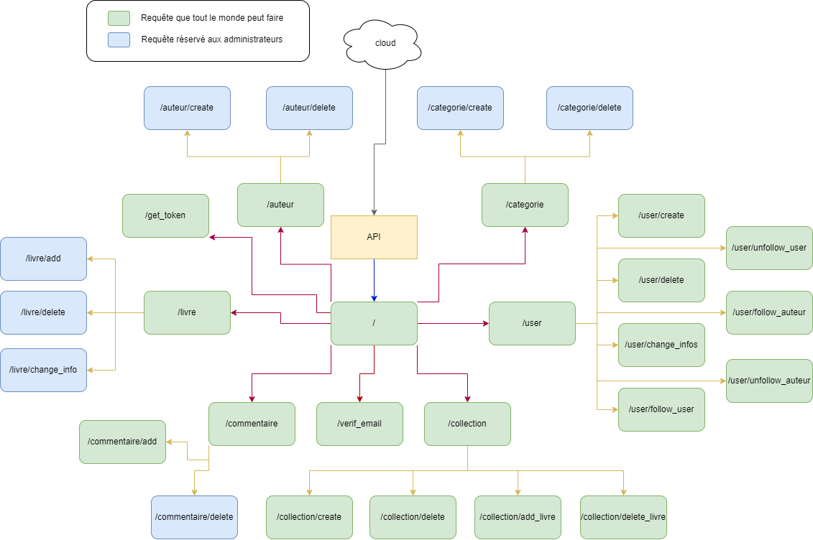

# To do List
- Ajouter les requetes d'auth dans le schema
- faire les codes des routes (changer la valeur de pasOk pour les routes sans authentification pour (/livre, /user, /auteur, /categorie, /user/create))

# API Projet Final B2 (avec Patchouf)

Vous trouverez dans ce repo la base de donnée de notre projet de fin de deuxième année.

- Repository principal : [Projet_Final_B2](https://github.com/Yann-Fournier/Projet_Final_B2)

### Ce repo contient :
- truc bidule

### Schéma de notre API :

